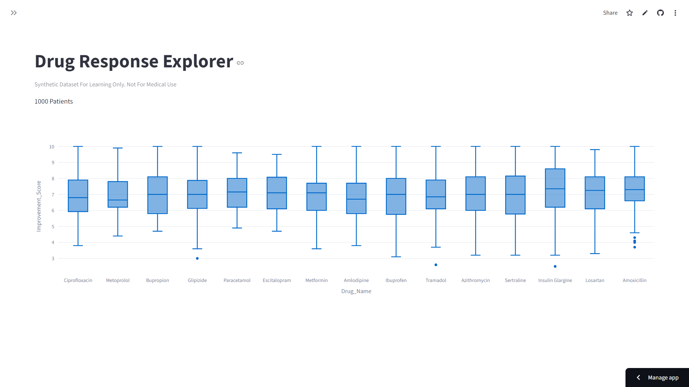
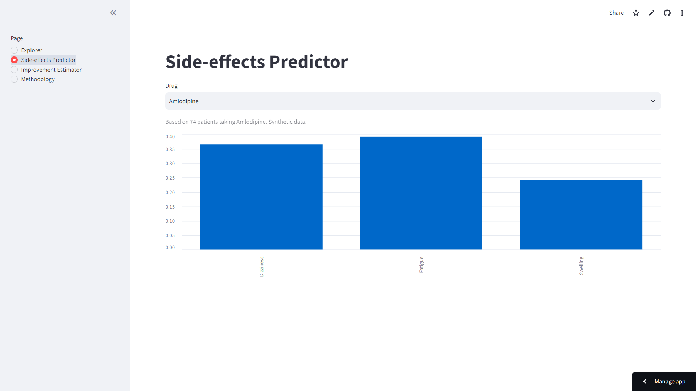
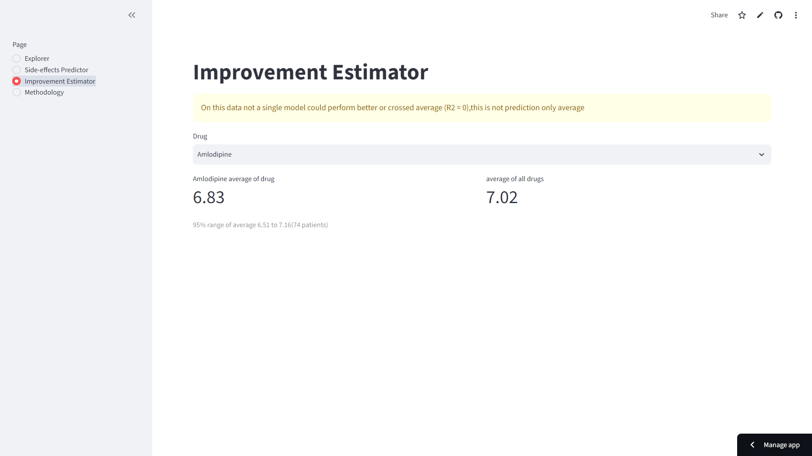
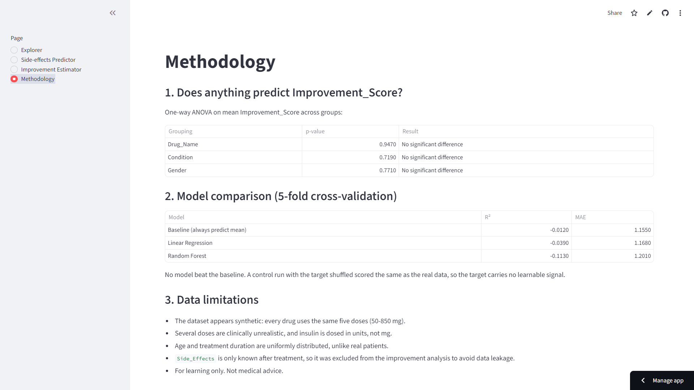

# Drug Response Explorer

An end-to-end data science project that tests whether patient and drug features can predict treatment improvement. On this dataset, they cannot, and the app says so openly.

**Live app:** https://drug-response-app-jdmvqbwzgqmweya2c89nzd.streamlit.app/

## Key findings
- ANOVA found no significant difference in `Improvement_Score` across drugs (p = 0.947), conditions (p = 0.719) or genders (p = 0.771).
- Linear Regression and Random Forest scored R² below zero in 5-fold cross-validation, i.e. worse than always predicting the mean.
- A control run with the target shuffled scored the same as the real data, so the target carries no learnable signal.
- What the data does support: each drug is tied to 2-3 specific side effects, so the app shows side-effect frequencies per drug.

## App pages
| Page | What it does |
|---|---|
| Explorer | Filter by condition and compare improvement scores across drugs |
| Side-effects Predictor | Observed side-effect frequencies for a chosen drug |
| Improvement Estimator | Average score with a 95% range, plus a clear "not a prediction" warning |
| Methodology | Statistical tests, model comparison and data limitations |

## Screenshots





## Data limitations
- The dataset appears synthetic: every drug uses the same five doses (50-850 mg), and several are clinically unrealistic.
- Age and treatment duration are uniformly distributed, unlike real patients.
- `Side_Effects` is only known after treatment, so it was excluded from the improvement models to avoid data leakage.
- For learning only. Not medical advice.

## Run locally
```bash
pip install -r requirements.txt
streamlit run app.py
```
The analysis notebook (`notebooks/01_eda.ipynb`) also needs scikit-learn, SciPy, seaborn, matplotlib and Jupyter.

## Built with
Python, pandas, SciPy, scikit-learn, Plotly, Streamlit

## Author
Tushar - [LinkedIn](https://www.linkedin.com/feed/)

## Source 
Kaggle dataset